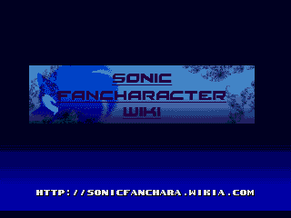

# SFCW Splash Screen



## Info

This is some random old (circa 2014) thing I have randomly. It's a Sonic Fan Character Wiki splash screen for classic Sonic games.

Eh, feel free to modify it however you want. :P

## Applying it to your ROM hack

Okay, first you have to have your modified Sonic 1/2/3K disassembly ready.

Download this by clicking on the big green **Code** button, then Download ZIP.

Extract the SFCW_Intro folder from this archive into your project folder.

Then follow these steps depending on which disassembly you have:

* [Sonic 1 Hivebrain](#sonic-1-hivebrain)
* [Sonic 1 HG](#sonic-1-hg)
* [Sonic 2](#sonic-2)
* [Sonic 3 and Knuckles](#sonic-3-and-knuckles)

### Sonic 1 Hivebrain

This is for the older 2005 Hivebrain disassembly. (the main file is "sonic1.asm")

First, we need to apply HCKTROX's S3K-style game mode handling fix. Find the "MainGameLoop" and "GameModeArray" labels. It should look like this:

```
MainGameLoop:
		move.b	($FFFFF600).w,d0 ; load	Game Mode
		andi.w	#$1C,d0
		jsr	GameModeArray(pc,d0.w) ; jump to apt location in ROM
		bra.s	MainGameLoop
; ===========================================================================
; ---------------------------------------------------------------------------
; Main game mode array
; ---------------------------------------------------------------------------

GameModeArray:
		bra.w	SegaScreen	; Sega Screen ($00)
; ===========================================================================
		bra.w	TitleScreen	; Title	Screen ($04)
; ===========================================================================
		bra.w	Level		; Demo Mode ($08)
; ===========================================================================
		bra.w	Level		; Normal Level ($0C)
; ===========================================================================
		bra.w	SpecialStage	; Special Stage	($10)
; ===========================================================================
		bra.w	ContinueScreen	; Continue Screen ($14)
; ===========================================================================
		bra.w	EndingSequence	; End of game sequence ($18)
; ===========================================================================
		bra.w	Credits		; Credits ($1C)
; ===========================================================================
		rts	
; ===========================================================================
```

Replace the whole thing with this:

```
MainGameLoop:
		move.b	($FFFFF600).w,d0
		andi.w	#$7C,d0
		movea.l	GameModeArray(pc,d0.w),a0
		jsr	(a0)
		bra.s	MainGameLoop
; ===========================================================================
; ---------------------------------------------------------------------------
; Main game mode array
; ---------------------------------------------------------------------------

GameModeArray:
		dc.l	SegaScreen		; Sega Screen ($00)
		dc.l	TitleScreen		; Title Screen ($04)
		dc.l	Level			; Demo Mode ($08)
		dc.l	Level			; Normal Level ($0C)
		dc.l	SpecialStage		; Special Stage   ($10)
		dc.l	ContinueScreen		; Continue Screen ($14)
		dc.l	EndingSequence		; Ending ($18)
		dc.l	Credits			; Credits ($1C)
		dc.l	SFCW_SplashStart	; SFCW Splash ($20)
		rts
```

Then find the label named "EndOfRom". Add this above it:

```
		include "SFCW_Intro/sfcw_splash_s1.asm"
```

Then, find the "Sega_GotoTitle" label. It should look like this.

```
Sega_GotoTitle:
		move.b #4,($FFFFF600).w
		rts
```

Replace it with:

```
Sega_GotoTitle:
		move.b #$20,($FFFFF600).w	; Go to SFCW screen
		rts
```

Last, build and enjoy. ;)

### Sonic 1 HG

This is for the newer HG disassembly. (the main file is "sonic.asm")

These are just basically the same steps as above, only with some labels changed.

First, we need to apply HCKTROX's S3K-style game mode handling fix. Find the "MainGameLoop" and "GameModeArray" labels. It should look like this:

```
MainGameLoop:
		move.b	(v_gamemode).w,d0 ; load Game Mode
		andi.w	#$1C,d0
		jsr	GameModeArray(pc,d0.w) ; jump to apt location in ROM
		bra.s	MainGameLoop
; ===========================================================================
; ---------------------------------------------------------------------------
; Main game mode array
; ---------------------------------------------------------------------------

GameModeArray:

ptr_GM_Sega:	bra.w	GM_Sega		; Sega Screen ($00)

ptr_GM_Title:	bra.w	GM_Title	; Title	Screen ($04)

ptr_GM_Demo:	bra.w	GM_Level	; Demo Mode ($08)

ptr_GM_Level:	bra.w	GM_Level	; Normal Level ($0C)

ptr_GM_Special:	bra.w	GM_Special	; Special Stage	($10)

ptr_GM_Cont:	bra.w	GM_Continue	; Continue Screen ($14)

ptr_GM_Ending:	bra.w	GM_Ending	; End of game sequence ($18)

ptr_GM_Credits:	bra.w	GM_Credits	; Credits ($1C)

		rts
```

Replace the whole thing with this:

```
MainGameLoop:
		move.b	(v_gamemode).w,d0
		andi.w	#$7C,d0
		movea.l	GameModeArray(pc,d0.w),a0
		jsr	(a0)
		bra.s	MainGameLoop
; ===========================================================================
; ---------------------------------------------------------------------------
; Main game mode array
; ---------------------------------------------------------------------------

GameModeArray:
		dc.l	GM_Sega			; Sega Screen ($00)
		dc.l	GM_Title		; Title Screen ($04)
		dc.l	GM_Level		; Demo Mode ($08)
		dc.l	GM_Level		; Normal Level ($0C)
		dc.l	GM_Special		; Special Stage   ($10)
		dc.l	GM_Continue		; Continue Screen ($14)
		dc.l	GM_Ending		; Ending ($18)
		dc.l	GM_Credits		; Credits ($1C)
		dc.l	SFCW_SplashStart	; SFCW Splash ($20)
		rts
```

Then find the label named "EndOfRom". Add this above it:

```
		include "SFCW_Intro/sfcw_splash_s1.asm"
```

Then, find the "Sega_GotoTitle" label. It should look like this.

```
Sega_GotoTitle:
		move.b	#id_Title,(v_gamemode).w ; go to title screen
		rts
```

Replace it with:

```
Sega_GotoTitle:
		move.b #$20,($FFFFF600).w	; Go to SFCW screen
		rts
```

Last, build and enjoy. ;)

### Sonic 2

Find "MainGameLoop" and "GameModesArray". It should look like this:

```
MainGameLoop:
	move.b	(Game_Mode).w,d0
	andi.w	#$3C,d0
	jsr	GameModesArray(pc,d0.w)
	bra.s	MainGameLoop
; ===========================================================================
; loc_3A2:
GameModesArray: ;;
GameMode_SegaScreen:	bra.w	SegaScreen		; SEGA screen mode
GameMode_TitleScreen:	bra.w	TitleScreen		; Title screen mode
GameMode_Demo:		bra.w	Level			; Demo mode
GameMode_Level:		bra.w	Level			; Zone play mode
GameMode_SpecialStage:	bra.w	SpecialStage		; Special stage play mode
GameMode_ContinueScreen:bra.w	ContinueScreen		; Continue mode
GameMode_2PResults:	bra.w	TwoPlayerResults	; 2P results mode
GameMode_2PLevelSelect:	bra.w	LevelSelectMenu2P	; 2P level select mode
GameMode_EndingSequence:bra.w	JmpTo_EndingSequence	; End sequence mode
GameMode_OptionsMenu:	bra.w	OptionsMenu		; Options mode
GameMode_LevelSelect:	bra.w	LevelSelectMenu		; Level select mode
```

Add this:

```
GameMode_SFCWScreen:	bra.w	Ptr_SFCWSplash	; SFCW splash screen
```

Before the "ChecksumError" label, add this:

```
Ptr_SFCWSplash:
	jmp	SFCW_SplashStart
	rts
```

Next, go to "Sega_GotoTitle". It should look like this:

```
Sega_GotoTitle:
	clr.w	(SegaScr_PalDone_Flag).w
	clr.w	(SegaScr_VInt_Subrout).w
	move.b	#GameModeID_TitleScreen,(Game_Mode).w	; => TitleScreen
	rts
```

Replace it with this:

```
Sega_GotoTitle:
	clr.w	(SegaScr_PalDone_Flag).w
	clr.w	(SegaScr_VInt_Subrout).w
	move.b	#$2C,(Game_Mode).w	; => SFCW_SplashStart
	rts
```

Before "; end of 'ROM'", add this:

```
	include "SFCW_Intro/sfcw_splash_s2.asm"
```

Last, build and enjoy. ;)

### Sonic 3 and Knuckles

This version goes right before the Sega logo, since the Sega logo is transitioned into the title screen.

It looks fine when you first start the game, but it looks messed up after a demo. :(

Find "GameLoop" and "GameModes". It should look like this:

```
GameLoop:
		move.b	(Game_mode).w,d0
		andi.w	#$7C,d0
		movea.l	GameModes(pc,d0.w),a0
		jsr	(a0)
		bra.s	GameLoop
; ---------------------------------------------------------------------------
GameModes:	dc.l Sega_Screen		;   0
		dc.l Title_Screen		;   4
		dc.l Level			;   8
		dc.l Level			;  $C
		dc.l JumpToSegaScreen		; $10
		dc.l ContinueScreen		; $14
		dc.l JumpToSegaScreen		; $18
		dc.l LevelSelect_S2Options	; $1C
		dc.l S3Credits			; $20
		dc.l LevelSelect_S2Options	; $24
		dc.l LevelSelect_S2Options	; $28
		dc.l BlueSpheresTitle		; $2C
		dc.l BlueSpheresResults		; $30
		dc.l SpecialStage		; $34
		dc.l Competition_Menu		; $38
		dc.l Competition_PlayerSelect	; $3C
		dc.l Competition_LevelSelect	; $40
		dc.l Competition_Results	; $44
		dc.l SpecialStage_Results	; $48
		dc.l SaveScreen			; $4C
		dc.l TimeAttack_Records		; $50
```

After "dc.l TimeAttack_Records", add this:

```
		dc.l	SFCW_SplashStart	; $54
```

Next, go to "Sega_Screen". Replace the whole thing with this:

```
Sega_Screen:
		move.b	#$54,(Game_mode).w
		rts
```

Before ";EndROMPadding", add this:

```
	include "SFCW_Intro/sfcw_splash_s3k.asm"
```

Last, build and enjoy. ;)

----

Updated:
* March 2, 2014
* August 20, 2016
* October 19, 2022

----

(This has not been updated yet to keep up with the latest versions, sorry)